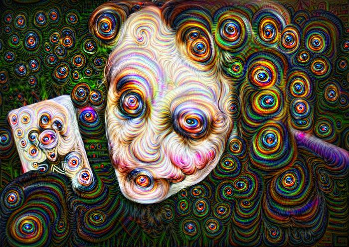
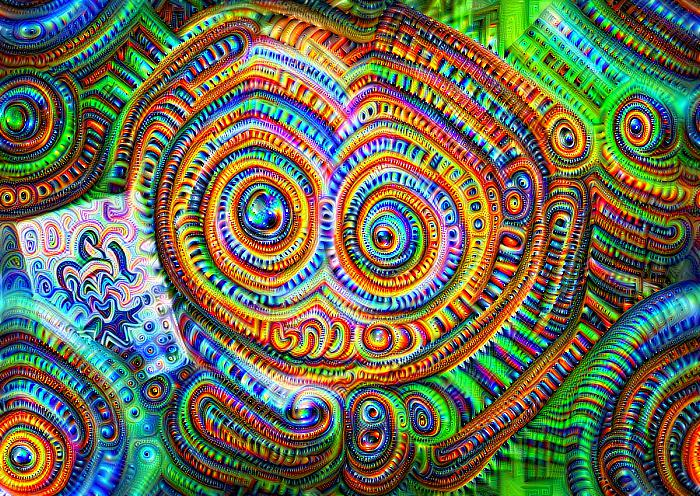

# Personal-Projects

Google DeepDream implementation with PyTorch.
I tried to produce dreams with VGG16, ResNet152 and DenseNet.

Here are some results with VGG16 :

Octave 6           |  Octave 12
:-------------------------:|:-------------------------:
  |  

I tried on some GIFs too.

